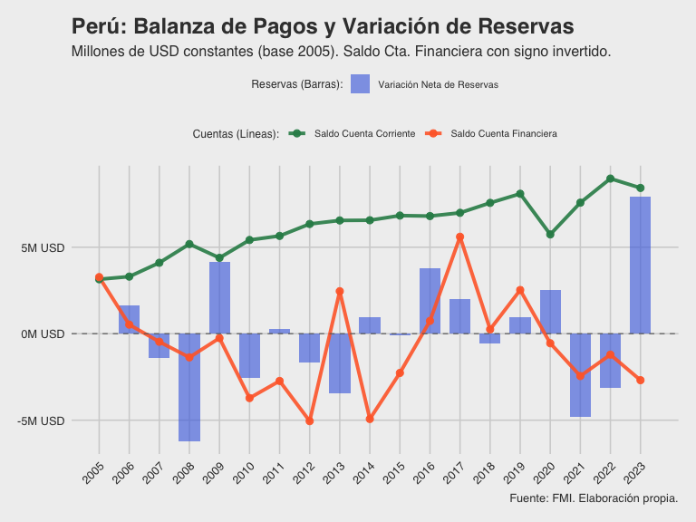

Análisis de Balanza de Pagos de Perú
================
Valentina Linares Herrera
2025-06-05

``` r
library(tidyverse)
library(ggthemes)
library(scales)
library(readr)

# Ruta FMI
ruta_fmi <- "bases/dataset_2025-06-03T21_56_23.308653517Z_DEFAULT_INTEGRATION_IMF.STA_BOP_AGG_9.0.1.csv"
base <- read_csv(ruta_fmi)

# Vistazo inicial a las columnas y datos de Perú
peru_df_inicial <- base[, c("COUNTRY", "INDICATOR", "TYPE_OF_TRANSFORMATION", "FREQUENCY","TIME_PERIOD","OBS_VALUE", "SCALE")]
head(peru_df_inicial) 
```

    ## # A tibble: 6 × 7
    ##   COUNTRY INDICATOR TYPE_OF_TRANSFORMATION FREQUENCY TIME_PERIOD OBS_VALUE SCALE
    ##   <chr>   <chr>     <chr>                  <chr>           <dbl>     <dbl> <chr>
    ## 1 All Co… Reserves… US dollar              Annual           2005   1.24e11 Bill…
    ## 2 All Co… Reserves… US dollar              Annual           2006   2.02e11 Bill…
    ## 3 All Co… Reserves… US dollar              Annual           2007   2.45e11 Bill…
    ## 4 All Co… Reserves… US dollar              Annual           2008   6.89e11 Bill…
    ## 5 All Co… Reserves… US dollar              Annual           2009   3.04e11 Bill…
    ## 6 All Co… Reserves… US dollar              Annual           2010   2.20e11 Bill…

``` r
# Extraer indicadores únicos
indicadores <- peru_df_inicial$INDICATOR %>%
  unique() %>%
  as_tibble()
print(indicadores) # Descomenta para ver la lista de indicadores
```

    ## # A tibble: 41 × 1
    ##    value                                                                        
    ##    <chr>                                                                        
    ##  1 Reserves minus liabilities constituting foreign authorities' reserves (LCFAR…
    ##  2 Secondary income, Credit/Revenue                                             
    ##  3 Financial derivatives (other than reserves) and employee stock options, Net …
    ##  4 Total capital account debit/expenditure, Debit/Expenditure                   
    ##  5 Goods, Credit/Revenue                                                        
    ##  6 Financial account balance (assets less liabilities), Net (net acquisition of…
    ##  7 Services balance (credit less debit), Net (credits less debits)              
    ##  8 Financial derivatives (other than reserves) and employee stock options, Net …
    ##  9 Services, Credit/Revenue                                                     
    ## 10 International investment position, Assets, Adjusted using IMF accounting rec…
    ## # ℹ 31 more rows

``` r
# Filtrar solo para Perú
peru_df <- base %>%
  filter(COUNTRY == "Peru") %>%
  select(COUNTRY, INDICATOR, TYPE_OF_TRANSFORMATION, FREQUENCY, TIME_PERIOD, OBS_VALUE, SCALE)
head(peru_df)
```

    ## # A tibble: 6 × 7
    ##   COUNTRY INDICATOR TYPE_OF_TRANSFORMATION FREQUENCY TIME_PERIOD OBS_VALUE SCALE
    ##   <chr>   <chr>     <chr>                  <chr>           <dbl>     <dbl> <chr>
    ## 1 Peru    Other in… US dollar              Annual           2005   -3.27e9 Mill…
    ## 2 Peru    Other in… US dollar              Annual           2006   -5.41e8 Mill…
    ## 3 Peru    Other in… US dollar              Annual           2007    4.95e8 Mill…
    ## 4 Peru    Other in… US dollar              Annual           2008    1.51e9 Mill…
    ## 5 Peru    Other in… US dollar              Annual           2009    2.78e8 Mill…
    ## 6 Peru    Other in… US dollar              Annual           2010    4.15e9 Mill…

``` r
# Ruta CPI (Consumer Price Index)
ruta_cpi <- "bases/CPI-U_BLS.csv"
cpi <- read_csv(ruta_cpi) %>%
  filter(Period == "M13", # Dato anual
         Year >= 2005) %>%
  select(Year, cpi_value = Value) %>% # Renombrado a cpi_value para evitar confusión con la función cpi
  arrange(Year) %>%
  mutate(cpi_index = (cpi_value / first(cpi_value)) * 100) # Base del índice 100 en el primer año (2005)

head(cpi)
```

    ## # A tibble: 6 × 3
    ##    Year cpi_value cpi_index
    ##   <dbl>     <dbl>     <dbl>
    ## 1  2005      195.      100 
    ## 2  2006      202.      103.
    ## 3  2007      207.      106.
    ## 4  2008      215.      110.
    ## 5  2009      215.      110.
    ## 6  2010      218.      112.

``` r
# Filtrar datos en dólares, unir con CPI y calcular valores constantes
peru_df_transformado <- peru_df %>%
  filter(TYPE_OF_TRANSFORMATION == "US dollar") %>%
  left_join(cpi, by = c("TIME_PERIOD" = "Year")) %>%
  mutate(valor_corr_millones = OBS_VALUE / 1000000, # En millones de USD corrientes
         valor_const_millones = ((valor_corr_millones / cpi_index) * 100)) # En millones de USD constantes base 2005

head(peru_df_transformado)
```

    ## # A tibble: 6 × 11
    ##   COUNTRY INDICATOR TYPE_OF_TRANSFORMATION FREQUENCY TIME_PERIOD OBS_VALUE SCALE
    ##   <chr>   <chr>     <chr>                  <chr>           <dbl>     <dbl> <chr>
    ## 1 Peru    Other in… US dollar              Annual           2005   -3.27e9 Mill…
    ## 2 Peru    Other in… US dollar              Annual           2006   -5.41e8 Mill…
    ## 3 Peru    Other in… US dollar              Annual           2007    4.95e8 Mill…
    ## 4 Peru    Other in… US dollar              Annual           2008    1.51e9 Mill…
    ## 5 Peru    Other in… US dollar              Annual           2009    2.78e8 Mill…
    ## 6 Peru    Other in… US dollar              Annual           2010    4.15e9 Mill…
    ## # ℹ 4 more variables: cpi_value <dbl>, cpi_index <dbl>,
    ## #   valor_corr_millones <dbl>, valor_const_millones <dbl>

``` r
# Definición de indicadores específicos
cuent_corr_str <- indicadores$value[13] 
cuent_fin_str <- indicadores$value[36]
reserv_str <- indicadores$value[23]

cuenta_corriente <- peru_df_transformado %>%
  filter(INDICATOR == cuent_corr_str) %>%
  mutate(nombre_limpio = "Saldo Cuenta Corriente")

cuenta_financiera <- peru_df_transformado %>%
  filter(INDICATOR == cuent_fin_str) %>%
  mutate(nombre_limpio = "Saldo Cuenta Financiera",
         valor_const_millones = -valor_const_millones, # Invertir para gráfico
         valor_corr_millones = -valor_corr_millones)

reservas <- peru_df_transformado %>%
  filter(INDICATOR == reserv_str) %>%
  mutate(nombre_limpio = "Variación Neta de Reservas", # Cambiado para reflejar variación
         var_anual_const = valor_const_millones - lag(valor_const_millones)) %>%
  drop_na(var_anual_const)

# Combinar series para gráfico final de cuentas y variación de reservas
series_cuentas_plot <- bind_rows(
  cuenta_corriente %>% select(TIME_PERIOD, valor_const_millones, nombre_limpio),
  cuenta_financiera %>% select(TIME_PERIOD, valor_const_millones, nombre_limpio)
)

# Paleta de colores
colors_palette <- c("Saldo Cuenta Corriente" = "#2E8B57", 
                    "Saldo Cuenta Financiera" = "#FF6B35", 
                    "Variación Neta de Reservas" = "#4169E1")

# Gráfico 1: Saldo de Cuenta Corriente     
p1 <- ggplot(cuenta_corriente, aes(x = TIME_PERIOD, y = valor_const_millones)) +
  geom_line(color = colors_palette["Saldo Cuenta Corriente"], linewidth = 1.2, alpha = 0.8) + # Usar linewidth en lugar de size
  geom_point(color = colors_palette["Saldo Cuenta Corriente"], size = 2.5, alpha = 0.9) +
  geom_hline(yintercept = 0, linetype = "dashed", color = "gray50", alpha = 0.7) +
  labs(
    title = "Perú: Saldo de Cuenta Corriente",
    subtitle = "Millones de USD constantes (base 2005)",
    x = "Año",
    y = "Millones de USD (constantes)",
    caption = "Fuente: FMI. Elaboración propia."
  ) +
  theme_fivethirtyeight() +
  theme(axis.text.x = element_text(angle = 45, hjust = 1)) +
  scale_x_continuous(breaks = 2005:2023) + # Ajusta el rango si es necesario
  scale_y_continuous(labels = function(x) paste0(x/1000, "M USD")) # Ajusta la escala si es necesario

print(p1)
```

<!-- -->

``` r
# Gráfico 2: Saldo de la Cuenta Financiera
p2 <- ggplot(cuenta_financiera, aes(x = TIME_PERIOD, y = valor_const_millones)) +
  geom_line(color = colors_palette["Saldo Cuenta Financiera"], linewidth = 1.2, alpha = 0.8) +
  geom_point(color = colors_palette["Saldo Cuenta Financiera"], size = 2.5, alpha = 0.9) +
  geom_hline(yintercept = 0, linetype = "dashed", color = "gray50", alpha = 0.7) +
  labs(
    title = "Perú: Saldo de Cuenta Financiera",
    subtitle = "Millones de USD constantes (base 2005). Signo invertido para comparación.",
    x = "Año",
    y = "Millones de USD (constantes)",
    caption = "Fuente: FMI. Elaboración propia."
  ) +
  theme_fivethirtyeight() +
  theme(axis.text.x = element_text(angle = 45, hjust = 1)) +
  scale_x_continuous(breaks = 2005:2023) +
  scale_y_continuous(labels = function(x) paste0(x/1000, "M USD"))

print(p2)
```

<!-- -->

``` r
# Gráfico 3: Variación Neta de Reservas
p3_var_reservas <- ggplot(reservas, aes(x = TIME_PERIOD, y = var_anual_const)) +
  geom_col(fill = colors_palette["Variación Neta de Reservas"], alpha = 0.7) +
  geom_hline(yintercept = 0, linetype = "dashed", color = "gray50", alpha = 0.7) +
  labs(
    title = "Perú: Variación Anual Neta de Reservas",
    subtitle = "Millones de USD constantes (base 2005)",
    x = "Año",
    y = "Millones de USD (constantes)",
    caption = "Fuente: FMI. Elaboración propia."
  ) +
  theme_fivethirtyeight() +
  theme(axis.text.x = element_text(angle = 45, hjust = 1)) +
  scale_x_continuous(breaks = 2005:2023) +
  scale_y_continuous(labels = function(x) paste0(x/1000, "M USD"))

print(p3_var_reservas)
```

<!-- -->

``` r
# Gráfico 4
reservas_plot_final <- reservas %>% mutate(nombre_limpio = "Variación Neta de Reservas")

grafico_final <- ggplot() +
  geom_col(data = reservas_plot_final,
           aes(x = TIME_PERIOD, y = var_anual_const, fill = nombre_limpio),
           alpha = 0.6, width = 0.7) +
  geom_line(data = series_cuentas_plot,
            aes(x = TIME_PERIOD, y = valor_const_millones, color = nombre_limpio, group = nombre_limpio),
            linewidth = 1.4, alpha = 0.9) +
  geom_point(data = series_cuentas_plot,
             aes(x = TIME_PERIOD, y = valor_const_millones, color = nombre_limpio),
             size = 2.5, alpha = 0.95) +
  geom_hline(yintercept = 0, linetype = "dashed", color = "gray40", alpha = 0.8) +
  scale_color_manual(values = colors_palette, name = "Cuentas (Líneas):") +
  scale_fill_manual(values = colors_palette, name = "Reservas (Barras):") +
  labs(
    title = "Perú: Balanza de Pagos y Variación de Reservas",
    subtitle = "Millones de USD constantes (base 2005). Saldo Cta. Financiera con signo invertido.",
    x = "Año",
    y = "Millones de USD (constantes)",
    caption = "Fuente: FMI. Elaboración propia."
  ) +
  theme_fivethirtyeight() +
  theme(axis.text.x = element_text(angle = 45, hjust = 1),
        legend.position = "top", # O "bottom", "left", "right"
        legend.title = element_text(size=9),
        legend.text = element_text(size=8)) +
  scale_x_continuous(breaks = 2005:2023) +
  scale_y_continuous(labels = function(x) paste0(x/1000, "M USD"))

print(grafico_final)
```

<!-- -->

``` r
# Gráfico5: Balanza de Bienes, Servicios e IED

# Definición de indicadores
balanza_bienes_str <- indicadores$value[16]
balanza_servicios_str <- indicadores$value[7]
inversion_extranjera_str <- indicadores$value[11]

# Filtrar los datos
bienes <- peru_df_transformado %>%
  filter(INDICATOR == balanza_bienes_str) %>%
  mutate(nombre_limpio = "Balanza de bienes")

servicios <- peru_df_transformado %>%
  filter(INDICATOR == balanza_servicios_str) %>%
  mutate(nombre_limpio = "Balanza de servicios")

# Balanza de bienes y servicios (suma)
bienes_servicios_combinado <- left_join(
    bienes %>% select(TIME_PERIOD, valor_const_bienes = valor_const_millones),
    servicios %>% select(TIME_PERIOD, valor_const_servicios = valor_const_millones),
    by = "TIME_PERIOD"
  ) %>%
  mutate(
    valor_const_millones = valor_const_bienes + valor_const_servicios,
    nombre_limpio = "Balanza de bienes y servicios"
  ) %>%
  select(TIME_PERIOD, valor_const_millones, nombre_limpio)

inversion <- peru_df_transformado %>%
  filter(INDICATOR == inversion_extranjera_str) %>%
  mutate(nombre_limpio = "Inversión extranjera directa")

# Combinar series
series_balanzas_plot <- bind_rows(
  bienes %>% select(TIME_PERIOD, valor_const_millones, nombre_limpio),
  servicios %>% select(TIME_PERIOD, valor_const_millones, nombre_limpio),
  bienes_servicios_combinado,
  inversion %>% select(TIME_PERIOD, valor_const_millones, nombre_limpio)
)

# Paleta de colores para este gráfico
colors_balanzas <- c(
  "Balanza de bienes" = "#A9D6E5",
  "Balanza de servicios" = "#7B8D8E",
  "Balanza de bienes y servicios" = "#8B0000", # Rojo oscuro
  "Inversión extranjera directa" = "#3CB371" # Verde
)

p_balanzas <- ggplot(series_balanzas_plot, aes(x = TIME_PERIOD, y = valor_const_millones, color = nombre_limpio, group = nombre_limpio)) +
  geom_line(data = ~.x %>% filter(nombre_limpio != "Balanza de bienes y servicios"), linewidth = 1.2) + # Líneas normales
  geom_line(data = ~.x %>% filter(nombre_limpio == "Balanza de bienes y servicios"), linewidth = 1.2, linetype = "dashed", alpha = 0.8) + # Línea punteada
  geom_point(data = ~.x %>% filter(nombre_limpio != "Balanza de bienes y servicios"), size = 2) + # Puntos para las series principales
  geom_hline(yintercept = 0, linetype = "dashed", color = "gray50", alpha = 0.7) +
  scale_color_manual(values = colors_balanzas, name = "Indicador:") +
  labs(
    title = "Perú: Balanza de Bienes, Servicios e IED",
    subtitle = "Millones de USD constantes (base 2005)",
    x = "Año",
    y = "Millones de USD (constantes)",
    caption = "Fuente: FMI. Elaboración propia."
  ) +
  theme_fivethirtyeight() +
  theme(
    axis.text.x = element_text(angle = 45, hjust = 1),
    legend.position = "top"
  ) +
  scale_x_continuous(breaks = 2005:2023) +
  scale_y_continuous(labels = function(x) paste0(x/1000, "M USD"))

print(p_balanzas)
```

<!-- -->
